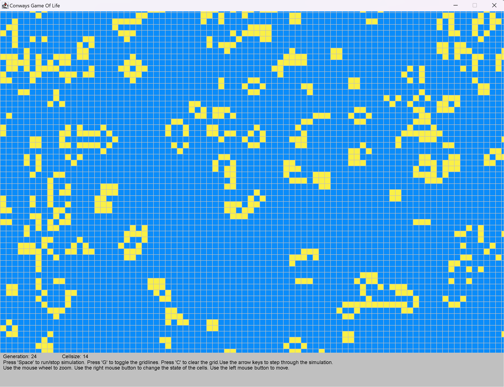

# Conway's Game Of Life
Of course - every programmers needs to implement this game once in their lifetime. This is my simple java-version of the 'Game Of Life' invented by John Conway in 1970.

  

